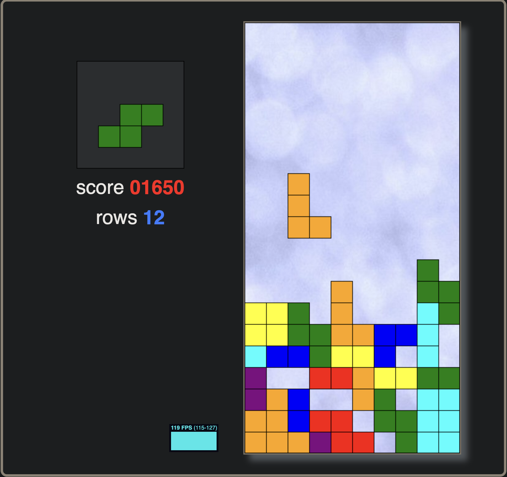

# Tetris Game

This is a classic Tetris game built with HTML, CSS, and JavaScript.

## What?

This project is a simple Tetris game with the following features:

*   **Classic Tetris gameplay:** Move and rotate the tetrominoes to complete lines.
*   **Score tracking:** Your score increases as you clear lines.
*   **Leaderboard:** The game features a Hall of Fame that displays the top 10 scores.
*   **Game over detection:** The game ends when the tetrominoes stack up to the top of the screen.
*   **Keyboard controls:** Use the arrow keys to move the tetrominoes and the spacebar to rotate them.

## How to Play

1.  **Download or clone the repository:**
    ```bash
    git clone https://github.com/your-username/js-tetris-leaderboard.git
    ```
2.  **Navigate to the project directory:**
    ```bash
    cd js-tetris-leaderboard
    ```
3.  **Open `public/index.html` in your browser.**

    _Note: The leaderboard functionality requires a PHP server to be running in the `src` directory._

4.  **Controls:**
    *   **Arrow keys:** Move the tetrominoes left, right, and down.
    *   **Up arrow key:** Rotate the tetromino.

## Screenshot



## Project Structure

```
js-tetris-leaderboard/
├── public/
│   ├── index.html
│   └── texture.jpg
├── src/
│   ├── getScores.php
│   ├── scores.txt
│   ├── stats.js
│   └── updateScores.php
├── .gitignore
├── LICENSE
└── README.md
```

## Credits

Credits and thanks to jakesgordon's javascript-tetris repo, code was taken as a blueprint and updated from that.